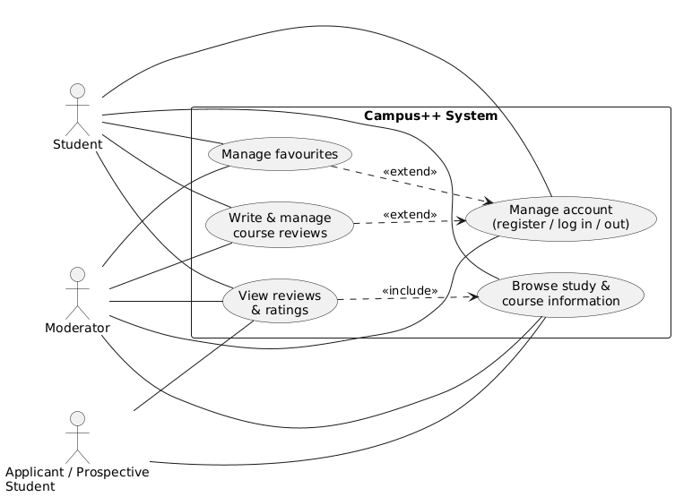

Marat Davlesthin, Lilie Lin, Tatiana Shvareva

Document history:

| **Version** | **Status** | **Date** | **Responsible person** | **Reason for change** |
| --- | --- | --- | --- | --- |
| 1.2 |  | 6.12.2025 | Tatiana Shvareva | updated the SRS due to stakeholders’ feedback  |

# 1. Introduction

## **1.1 Purpose**

This Software Requirements Specification (SRS) defines the functional and non-functional requirements for the first release of the Campus++ web application.

Campus++ is a community-driven platform for students, applicants, and moderators of Hochschule Campus Wien (HCW). The system centralizes study program information, course details, reviews, and discussion features.

The SRS serves as a basis for design, implementation, testing, and evaluation.

## **1.2 Background and Goals**

Currently, HCW students must rely on fragmented tools such as Discord, StudyCheck, private chats, or WhatsApp groups.

There is **no central, structured platform** covering:

- all studies & courses of HCW
- student-generated course feedback
- exam experiences
- discussion threads per lecture
- platform for material sharing

**Goal:** Campus++ shall provide a centralized, community-driven academic platform tailored to HCW that:

- helps students and applicants understand courses and study programs,
- enables students to share experiences and materials,
- offers basic moderation tools to keep content helpful and respectful.

## 1.3 Product scope

Campus++ is a web application that runs in modern browsers (desktop and mobile).

Users can:

- browse study programs and courses,
- read and write reviews,
- manage favourites,
- report problematic content,
- (in later versions) upload materials and participate in discussion threads.

The technical architecture is defined in the HLD document.

## 1.4 Definitions, Acronyms, Abbreviations

- **HCW** – Hochschule Campus Wien.
- **Campus++** – proposed web application with course information, reviews, materials, and discussion spaces.
- **Study Program** – academic degree program (e.g., Computer Science and Digital Communications).
- **Course / Lecture** – a single teaching unit within a study program.
- **Entry** – structured information related to a study program or course (e.g. workload, semester, language of instruction).
- **Review** – user-generated rating (e.g. 1–5) with optional text for a course or study program.
- **Thread / Discussion Thread** – conversation space linked to a specific course or study program.
- **Post / Comment** – message created in a thread (post) or response to a post (comment).
- **Favourite** – course or study program bookmarked by a user.
- **User Roles**:
    - **Applicant / Prospective Student** – read-only access to public information and reviews; can participate in discussions if enabled.
    - **Student** – full read access plus write permissions (reviews, posts, comments, materials, reports).
    - **Moderator** – all student rights plus moderation actions (handle reports, hide/delete content, approve suggested edits).
- **MoSCoW Prioritization** – classification of requirements:
    - **Must** – mandatory for a usable first release.
    - **Should** – important but not strictly necessary for the first release.
    - **Could** – nice-to-have additions, implemented if time and resources permit.
    - **Won’t** – explicitly out of scope for this project.

## 1.5 References

- **Hochschule Campus Wien – Official Website**

  [https://www.hcw.ac.at](https://www.fh-campuswien.ac.at/)

  (Source for official course and study program descriptions.)

- **IEEE 830-1998 – Software Requirements Specification Standard**

  Used as a general guideline for structuring this SRS.

- **MoSCoW Prioritization Technique**

  A method for classifying requirements into Must/Should/Could/Won’t.

- **User Interface and UX Guidelines**

  Nielsen Norman Group: https://www.nngroup.com/articles/

  (For general usability and ergonomic considerations.)

- **Web Application Security Standards**

  OWASP Top 10: https://owasp.org/www-project-top-ten/

  (Used for defining security-related requirements.)

# 2. Product Use

### 2.1 Areas of Application

- Academic course and study program overview
- Course review and feedback platform
- Community and knowledge sharing among HCW students

### 2.2 Target User Groups

- **Current HCW students** – main contributors of reviews, discussions, and materials.
- **Prospective students/applicants** – mainly consumers of information and reviews.
- **Moderators** (e.g. tutors, student representatives) – responsible for keeping content constructive and compliant.

### 2.3 Operating Conditions

- Runs in up-to-date web browsers on desktop and mobile devices.
- Requires stable internet connection.
- Requires user registration and login for write-access features (reviews, reports, moderation).
- Uses official HCW data sources for study programs and courses.

# 3. Functional Requirements (MoSCoW, Rupp)

All functional requirements below follow the MoSCoW prioritization and are formulated using a Rupp-style structure (“The system shall…”).

## 3.1 Must Requirements

**FR-M-1 (Must)**

The system shall allow users to view a list of at least one HCW study program on the homepage.

**FR-M-2 (Must)**

The system shall allow users to view a list of at least five HCW courses across one or more study programs.

**FR-M-3 (Must)**

The system shall display a course detail page showing at least: course title, short description, study program and semester.

**FR-M-4 (Must)**

The system shall display a study program detail page showing at least: program title, short description, degree type and list of associated courses.

**FR-M-5 (Must)**

The system shall allow a user to register a new account using email (or HCW ID) and password.

**FR-M-6 (Must)**

The system shall allow a registered user to log in using email (or HCW ID) and password and start an authenticated session.

**FR-M-7 (Must)**

The system shall support the roles Student, Applicant and Moderator.

**FR-M-8 (Must)**

The system shall enforce role-based access such that only Students and Moderators can create or edit reviews and only Moderators can access moderation views.

**FR-M-9 (Must)**

The system shall allow logged-in users with role Student or Moderator to create a course review with a rating from 1 to 5 and optional text.

**FR-M-10 (Must)**

The system shall store submitted reviews persistently and link each review to a course and its author.

**FR-M-11 (Must)**

The system shall display all existing reviews and the average rating on the corresponding course detail page to all users, including users who are not logged in.

**FR-M-12 (Must)**

The system shall allow logged-in users to add courses and study programs to their favourites list.

**FR-M-13 (Must)**

The system shall allow logged-in users to remove items from their favourites list.

**FR-M-14 (Must)**

The system shall provide a view where a logged-in user can see their favourites list.

**FR-M-15 (Must)**

The system shall allow logged-in users to report a review as inappropriate by selecting a reason from a predefined list and optionally entering a comment.

**FR-M-16 (Must)**

The system shall provide a moderator view that lists all open reports.

**FR-M-17 (Must)**

The system shall allow Moderators to change the status of a reported review to at least “keep visible”, “edit” or “delete”.

## 3.2 Should Requirements

**FR-S-1 (Should)**

The system should allow users to filter courses by study program and at least one additional attribute (for example semester or difficulty).

**FR-S-2 (Should)**

The system should allow users to sort reviews on a course page by newest first, oldest first, highest rating and lowest rating.

**FR-S-3 (Should)**

The system should display a simple campus map showing at least one HCW building relevant for the selected study program.

**FR-S-4 (Should)**

The system should display the current number of open reports in the moderator navigation (for example as a badge with a number).

## 3.3 Could Requirements

**FR-C-1 (Could)**

The system could allow users with role Student or Moderator to upload files (for example PDFs or images) as course materials with a maximum file size.

**FR-C-2 (Could)**

The system could provide discussion threads for each course where users can create posts and comments.

**FR-C-3 (Could)**

The system could allow users to react to posts or reviews with simple reactions (for example a thumbs-up icon).

**FR-C-4 (Could)**

The system could send e-mail notifications to users who opted in when there is new activity in a watched course or thread.

## 3.4 Won’t

**FR-W-1 (Won’t)**

The system will not provide video calls or real-time chat.

**FR-W-2 (Won’t)**

The system will not provide dating or “Campus Tinder” functionality.

**FR-W-3 (Won’t)**

The system will not include official timetables, grades or calendars that are already covered by Campus+.

**FR-W-4 (Won’t)**

The system will not integrate external exam-registration systems.

**FR-W-5 (Won’t)**

The system will not provide advanced analytics dashboards.

# 4. Non-functional Requirements

All non-functional requirements are formulated to allow objective verification.

## **4.1 Performance**

- **NFR-1** For 95% of requests to course and study program pages under normal load, the server response time shall not exceed 2 seconds.

## **4.2 Security**

- **NFR-2** Passwords stored using secure hashing.
- **NFR-3** Only authenticated users can write content.
- **NFR-4** All communication over HTTPS.

## **4.3 Reliability**

- **NFR-5** Availability ≥ 99% per month.
- **NFR-6** Automated daily backups.

## **4.4 Usability**

- **NFR-7** Clean UI accessible without training.
- **NFR-8** Main functions reachable within three clicks.

# 5. Appendix

### 5.1 Glossary

(See Definitions in Section 1.4; can be extended if new terms are introduced.)

# 6. UML Diagram

## Use Cases:

### 1. Browse study & course information

- **Actor:** Student, Applicant / Prospective Student, Moderator
- **Description:** The user views basic information about study programs and courses (title, description, semester, links, etc.).
- **Stimulus:** The user opens the website and clicks on a study program or a course.
- **Response:** The system shows the selected study or course page with all available information.
- **Comment:** No login is required. This use case is always available to all roles.

### 2. View reviews & ratings

- **Actor:** Student, Applicant / Prospective Student, Moderator
- **Description:** The user reads existing course reviews and ratings.
- **Stimulus:** From a course page, the user opens the “Reviews” section.
- **Response:** The system loads and displays all reviews and the average rating for the course.
- **Comment:** This use case **includes** “Browse study & course information”, because the user must be on a course page first.

### 3. Manage account (register / log in / out)

- **Actor:** Student, Moderator
- **Description:** The user creates an account, logs in, or logs out.
- **Stimulus:** The user clicks on “Register”, “Log in”, or “Log out” in the navigation.
- **Response:**
    - For register: the system shows a form, validates input, creates an account, and logs the user in.
    - For log in: the system checks credentials and starts a session.
    - For log out: the system ends the session and returns to public view.
- **Comment:** A logged-in account is a **precondition** for writing reviews, managing favourites, reporting content, and moderation.

### 4. Manage favourites

- **Actor:** Student, Moderator
- **Description:** The user adds or removes courses or study programs from a personal favourites list.
- **Stimulus:** The user clicks on a “Add to favourites” or “Remove from favourites” button on a course or study page.
- **Response:**
    - The system updates the favourites list for the logged-in user.
    - The UI shows the new state (e.g., filled / empty star icon).
- **Comment:** Requires the user to be logged in. If not logged in, the system redirects to “Manage account”.

### 5. Write & manage course reviews

- **Actor:** Student, Moderator
- **Description:** The user writes a new course review, edits their own review, or deletes it.
- **Stimulus:** On a course page, the user clicks “Write review” or “Edit / Delete review”.
- **Response:**
    - The system shows a form (rating + text), validates input, and saves changes.
    - The course page is updated and shows the new or updated review.
- **Comment:** This use case **extends** “Manage account”: only logged-in users with the Student or Moderator role may create or edit reviews.